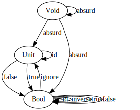
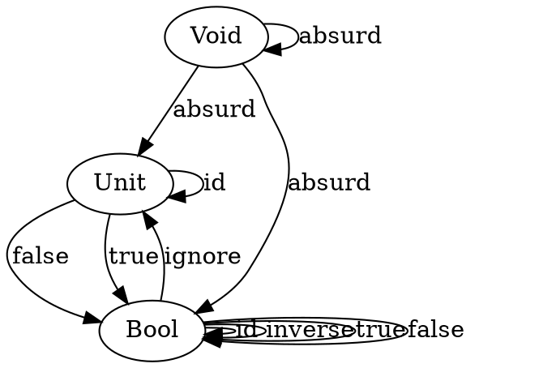

# Types and Functions
### 1. Define a higher-order function (or a function object) `memoize` in your favorite language. This function takes a pure function f as an argument and returns a function that behaves almost exactly like f, except that it only calls the original function once for every argument, stores the result internally, and subsequently returns this stored result every time it’s called with the same argument. You can tell the memoized function from the original by watching its performance. For instance, try to memoize a function that takes a long time to evaluate. You’ll have to wait for the result the first time you call it, but on subsequent calls, with the same argument, you should get the result immediately.
```java
import java.util.HashMap;
import java.util.Map;
import java.util.function.Function;

class Scratch {
    static <T, R> Function<T, R> memoize(Function<T, R> fn) {
        Map<T, R> table = new HashMap<>();
        return (T in) -> {
            table.computeIfAbsent(in, fn);
            return table.get(in);
        };
    }
}
```

### 2. Try to memoize a function from your standard library that you normally use to produce random numbers. Does it work?

No. The return value is always the same because the input is always the same.

```java
import java.util.HashMap;
import java.util.Map;
import java.util.Random;
import java.util.function.Function;

class Scratch {
    public static void main(String[] args) {
        Function<Void, Double> random = (Void nothing) -> {
            var rn = new Random();
            return rn.nextDouble();
        };

        Function<Void, Double> memoRandom = memoize(random);

        System.out.println(memoRandom.apply(null));
        System.out.println(memoRandom.apply(null));
        System.out.println(memoRandom.apply(null));
    }
}
```
### 3. Most random number generators can be initialized with a seed. Implement a function that takes a seed, calls the random number generator with that seed, and returns the result. Memoize that function. Does it work?

No, for the same reason as question #2.

```java
import java.util.HashMap;
import java.util.Map;
import java.util.Random;
import java.util.function.Function;

class Scratch {
    public static void main(String[] args) {
        Function<Void, Double> random = (Void nothing) -> {
            var seed = 42;
            var rn = new Random(seed);
            return rn.nextDouble();
        };

        Function<Void, Double> memoRandom = memoize(random);

        System.out.println(memoRandom.apply(null));
        System.out.println(memoRandom.apply(null));
        System.out.println(memoRandom.apply(null));
    }
}
```

### 4. Which of these C++ functions are pure? Try to memoize them and observe what happens when you call them multiple times: memoized and not.

#### 4a.
The factorial function from the example in the text.
```c++
int fact(int n) {
    int i;
    int result = 1;
    for (i = 2; i <= n; ++i)
        result *= i;
    return result;
}
```
Pure. This works correctly when memoized.

#### 4b.
```c++
std::getchar()
```
Impure. Uses I/O. This will always return the same value.

#### 4c.
```c++
bool f() { 
    std::cout << "Hello!" << std::endl;
    return true; 
}
```
Impure. Uses I/O. This will only print "Hello!" once. It will always return true.

#### 4d.
```c++
int f(int x)
{
    static int y = 0;
    y += x;
    return y;
}
```
Impure. Uses global state. This will return a different value when memoized depending on how many times it's been called before.

### 5. How many different functions are there from Bool to Bool? Can you implement them all?

4 different functions.

```typescript
(_: boolean) => true;
(_: boolean) => false;
(b: boolean) => b;
(b: boolean) => !b;
```

### 6. Draw a picture of a category whose only objects are the types Void, () (unit), and Bool; with arrows corresponding to all possible functions between these types. Label the arrows with the names of the functions.



[View on GraphViz online](https://dreampuf.github.io/GraphvizOnline/#digraph%20Category%20%7B%0A%20%20%20%20Void%0A%20%20%20%20Unit%0A%20%20%20%20Bool%0A%20%20%20%20%0A%20%20%20%20Void%20-%3E%20Void%5Blabel%3D%22absurd%22%5D%0A%20%20%20%20Void%20-%3E%20Unit%5Blabel%3D%22absurd%22%5D%0A%20%20%20%20Void%20-%3E%20Bool%5Blabel%3D%22absurd%22%5D%0A%20%20%20%20%0A%20%20%20%20Unit%20-%3E%20Bool%5Blabel%3D%22false%22%5D%0A%20%20%20%20Unit%20-%3E%20Bool%5Blabel%3D%22true%22%5D%0A%20%20%20%20Unit%20-%3E%20Unit%5Blabel%3D%22id%22%5D%0A%20%20%20%20%0A%20%20%20%20Bool%20-%3E%20Bool%5Blabel%3D%22id%22%5D%0A%20%20%20%20Bool%20-%3E%20Bool%5Blabel%3D%22inverse%22%5D%0A%20%20%20%20Bool%20-%3E%20Bool%5Blabel%3D%22true%22%5D%0A%20%20%20%20Bool%20-%3E%20Bool%5Blabel%3D%22false%22%5D%0A%20%20%20%20Bool%20-%3E%20Unit%5Blabel%3D%22ignore%22%5D%0A%7D)

