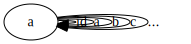

# Categories Great and Small

###  1. Generate a free category from:
#### 1a. A graph with one node and no edges

#### 1b. A graph with one node and one (directed) edge (hint: this edge can be composed with itself)

Edges from a node to itself are infinitely composable. I've left those arrows out for the sake of brevity.

####  1c. A graph with two nodes and a single arrow between them

####  1d. A graph with a single node and 26 arrows marked with the letters of the alphabet: a, b, c … z.

Edges from a node to itself are infinitely composable. I've left those arrows out for the sake of brevity.

### 2.  What kind of order is this?
#### 2a. A set of sets with the inclusion relation: A is included in B if every element of A is also an element of B.
A must be a subset of B to satisfy the inclusion relation. There cannot be an element in A that is not also in B. B may have elements that are not in A; B has at least the elements that are in A, therefore B must be a superset of A.

There may be elements in B that are not comparable to elements in A, therefore this cannot be a total order. This relation satisfies the definition of antisymmetry because (a <= b == b <= a == (a == b)), therefore it is a partial order.

#### 2b. C++ types with the following subtyping relation: T1 is a subtype of T2 if a pointer to T1 can be passed to a function that expects a pointer to T2 without triggering a compilation error.
This is a partial order. T2 is a superset or T1 while T1 is a subset T2.

###  3. Considering that Bool is a set of two values True and False, show that it forms two (set-theoretical) monoids with respect to, respectively, operator && (AND) and || (OR).
A monoid is a set with a binary operation. The set would be the values [True, False] with the operations AND and OR. The operation must be associative and there must be an element that acts as a unit.

AND is associative:
* TRUE && (TRUE && TRUE) = (TRUE && TRUE) && TRUE = TRUE
* FALSE && (TRUE && TRUE) = (FALSE && TRUE) && FALSE = FALSE

OR is associative:
* TRUE || (TRUE || TRUE) = (TRUE || TRUE) || TRUE = TRUE
* FALSE || (TRUE || TRUE) = (FALSE || TRUE) || FALSE = FALSE

The unit for AND is True. The unit for OR is False.

###  4. Represent the Bool monoid with the AND operator as a category: List the morphisms and their rules of composition.

Composition:
* x && True . x && True == x && True
* x && True . x && False == x && False
* x && False . x && False == x && False
* x && False . x && True == x && False

###  5. Represent addition modulo 3 as a monoid category.
(+ 0) % 3 is the closest thing to an identity morphism for the object in this category. It meets all of the criteria, but it's a little strange. For the value 3 within Number the identity function will return 0. I think that this is technically acceptable based on the mathematical/categorical definition of identity, but it isn't very intuitive to me.

