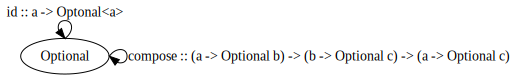
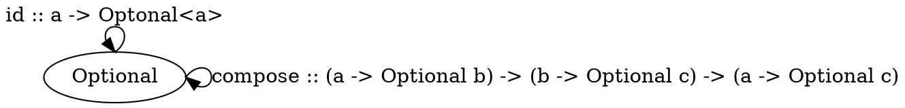

# Kleisli Categories
### 1. Construct the Kleisli category for partial functions (define composition and identity).



```java
<T> Optional<T> id(T element) {
	return Optional.of(element)
}

<A, B, C> Function<A, Optional<C>> compose(Function<A, Optional<B>> fn1, Function<B, Optional<C>> fn2) {
	return (A element) -> {
		var first = fn1.apply(element);
		if (first.isPresent()) {
			 return fn2.apply(first.get());
		} else {
			return Optional.empty();
		}
	}
}
```

### 2. Implement the embellished function safe_reciprocal that returns a valid reciprocal of its argument, if it’s different from zero.
```java
Optional<Double> safeReciprocal(double n) {
	if (n == 0) {
		return Optional.empty();
	}
	return Optional.of(1 / n);
}
```

### 3. Compose safe_root and safe_reciprocal to implement safe_root_reciprocal that calculates sqrt(1/x) whenever possible.
```java
Optional<Double> safeRoot(double n) {
	if (n >= 0) {
		return Optional.of(Math.sqrt(n));
	} else {
		return Optional.empty();
	}
}
```

```java
Function<Double, Optional<Double>> safeRootReciprocal = compose(safeReciprocal, safeRoot);
```
