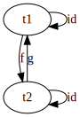
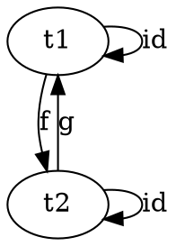

# Products and Coproducts
### 1. Show that the terminal object is unique up to unique isomorphism.
First, some definitions:
* Initial object: The object with one and only one morphim going to any object in the category
* Terminal object: The object with one and only one morphism coming to it from any object in the category
* Isomorphim (category theory): There exists a morphism from object A to object B and a morphism from object B back to object A (f A = B, g B = A)
* Unique isomorphism: Isomorphism, but there exists exactly one morphism from object A to object B and vice-versa

This is basically a copy of the proof that initial objects are unique up to unique isomorphism, because initial objects and terminal objects are the inverse.

A terminal object has one and only one morphism coming to it from any object in the category. The composition of f and g to either object is the object passed `f . g t1 = t1`. There can only be one morphism, and there must be an identity morphism because we are in a category, therefore the morphism that exists must be the identity morhpism. `f . g = id` and `g . f = id`. This shows that any two terminal objects are unique up to unique isomorphism.




### 2. What is a product of two objects in a poset? Hint: Use the universal construction.


### 3. What is a coproduct of two objects in a poset?
### 4. Implement the equivalent of Haskell Either as a generic type in your favorite language (other than Haskell).
### 5. Show that Either is a “better” coproduct than int equipped with two injections:
```c++
    int i(int n) { return n; }
    int j(bool b) { return b? 0: 1; }

    # Hint: Define a function

    int m(Either const & e);

    # that factorizes i and j.
```

### 6. Continuing the previous problem: How would you argue that int with the two injections i and j cannot be “better” than Either?
### 7. Still continuing: What about these injections?

```c++
    int i(int n) { 
        if (n < 0) return n; 
        return n + 2;
    }
    int j(bool b) { return b? 0: 1; }
```

### 8. Come up with an inferior candidate for a coproduct of int and bool that cannot be better than Either because it allows multiple acceptable morphisms from it to Either.
